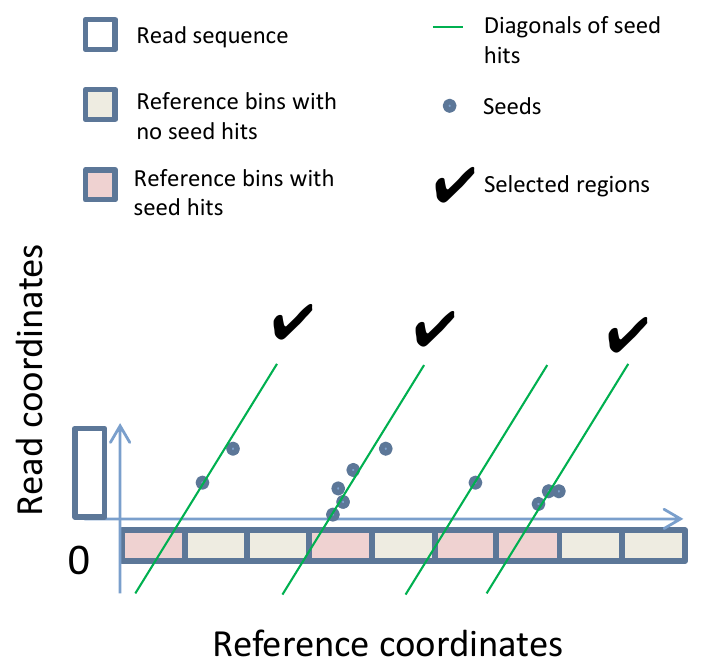
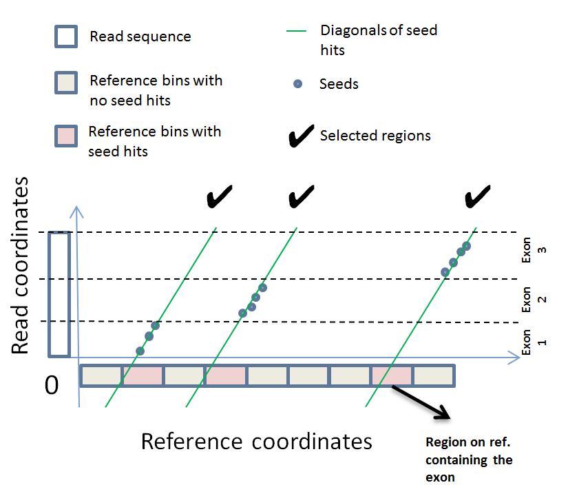
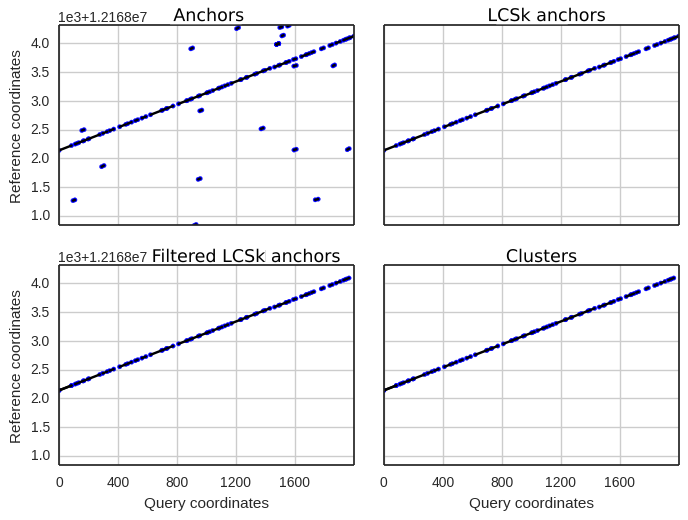
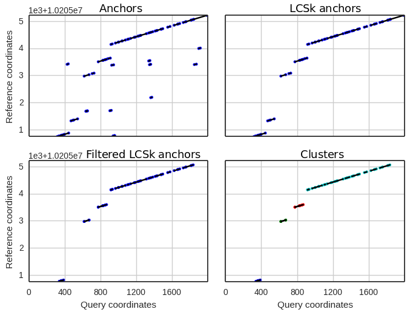

## Mapping RNA-seq reads  

### 1. Transcriptome mapping  
Since version 0.4.0, GraphMap has a support for mapping reads to internally generated transcriptomes.  
These features are available on the ```master``` branch of the GraphMap repo.  
To use this feature, a ```GTF``` annotations file is needed alongside the reference ```FASTA```.  
The goal of this option is to simplify the process for end-users. The final alignments are also automatically transformed back to genomic coordinates, thus completely wrapping the entire process.

<!-- Depiction of how this is implemented is presented in [Figure 1](link). -->

To use this feature, simply specify ```--gtf annotations.gtf``` alongside to other command line parameters.  

**Acknowledgements**  
Mile Šikić (MS) and Niranjan Nagarajan (NN) proposed the implementation of this approach for RNA-seq mapping. Ivan Krpelnik (IK) implemented the initial version of the transcriptome generator, as well as the conversion utility to convert from transcriptome space back to genome space. IK worked under guidance from Krešimir Križanović (KK) and Ivan Sović (IS). The new methods were embedded in existing GraphMap source code by IS. KK was/is working on evaluation and benchmarking of our RNA-seq methods. Mile Šikić (MS) supervised the project.

### 2. Spliced alignments  
Support for spliced alignments in GraphMap is a work in progress and currently experimental.  
To activate this mode, specify ```-x rnaseq``` alongside to other command line parameters. This feature is available on the ```rna-alpha``` branch. Install and compile in the testing mode as such:  
```  
git clone https://github.com/isovic/graphmap  
cd graphmap  
git checkout rna-alpha  
make modules  
make -j 4 testing  
```  

After this, run GraphMap using:  
```  
bin/graphmap-not_release align -x rnaseq -r ref.fa -d reads.fastq -o out.sam  
```  

***Please be aware*** that this is currently a highly experimental. It is not production-ready. Implementation may vary significantly from implementation to implementation.
<!-- This is a composite option which is equivalent to
Equivalent to: ```--ambiguity 0.5 --secondary --min-bin-perc 0.01 --bin-step 0.99 --max-regions 20 --spliced``` -->

Here is a short description of the approach we are taking.

**2.1 Region selection**  
The GraphMap [paper](http://www.nature.com/ncomms/2016/160415/ncomms11307/full/ncomms11307.html) describes the region selection process (first step in GraphMap). In short, an array of bins is constructed, where each bin represents a consecutive, non-overlapping region of the reference, where each bin is of size ```read_length / 3```. For each seed of an analyzed read, all hits on the reference are looked-up. For each hit, ```+1``` is added to a bin corresponding to region where the hit falls into. (If a seed has multiple hits in the same region, only one is counted).



Regions are then sorted in descending order of their counts and further processed one by one. Before a region is processed, it is first extended on both ends (by ```read_length```) so that the entire read may fit inside after the alignment.  
This approach was shown to be very well suited for detecting secondary alignments, as different regions which might contain similarly good alignments would be processed individually.  
In the default alignment mode, this approach can produce pretty sensitive alignments.

Now consider mapping of RNA-seq reads. In this case, a read can actually be split into several distant regions across a chromosome. Should the same region selection strategy be applied, the bin counts would simply redistribute to different regions. This means that, should the exons have a few good seed hits, we could detect the correct regions and further process them to obtain the spliced alignments. Of course, noise hits will cause trouble (this will be addressed in continuation). For RNA-seq, regions are also sorted by their bin counts and further processed using the Graph Mapping and the LCSk steps.



**2.2. Graph Mapping and LCSk**  
For each region, Graph Mapping is performed to obtain anchors (matches between the read and the region). Anchors are filtered using the LCSk method.  
These steps are the same as in normal DNA mapping case.  

However, here we add a method of **clustering anchors** after they have been filtered. Clusters are obtained using the classic chaining approach which joins anchors that are close enough, and are nearly on the same diagonal.  
Clusters then represent larger matching chunks between a read and a reference.  

For normal DNA mapping, one would ideally (in the abscence of structural variants) expect to see one large cluster, such as shown below:  



However, in case of RNA-seq mapping (or in presence of structural variants) such a graph might look like something closer to the following figure:  



What's more, viewed in such way, a cluster actually can represent an *exon*!  
Now, if we collect all clusters (some of them being possible repeats), we can use this information to create our spliced alignments!  

But, hold on. Since some exons can be separated by a large gap on the reference (much larger than the read), we need to consider other regions simultaneously.  

For this reason, all clusters (represented with their start and end coordinates in both the reference and the read) for all analyzed regions are first collected in a single list.  

Then, the **knapsack** algorithm is applied on the list of clusters.  

**2.3 Knapsack algorithm**  
[Knapsack problem](https://en.wikipedia.org/wiki/Knapsack_problem) is a problem of combinatorial optimization. Given a set of items, each with a weight and a value, the problem it tries to solve is "how to fill a knapsack with items so that the total weight is less than or equal to the given limit, and the value is as large as possible".

In our case:  
- Knapsack is a *read*
- Weight limit is the read length
- An item is a cluster
- Item weight is the length of the cluster in the read coordinate space  

Now, solving the knapsack problem would result in a list of clusters which fill the read the most. Alignment is then performed only on those clusters, and reported as separate SAM lines - one for each cluster (exon).  

**Acknowledgements**  
Ivan Sović (IS) proposed this solution for mapping of RNA-seq reads based on the knapsack algorithm. The initial version of the knapsack algorithm was implemented by Antonio Jurić (AJ). It was embedded in existing GraphMap source code by IS. Krešimir Križanović (KK) was/is working on evaluation and benchmarking of our RNA-seq methods and helped guide AJ. Mile Šikić (MS) supervised the project.
